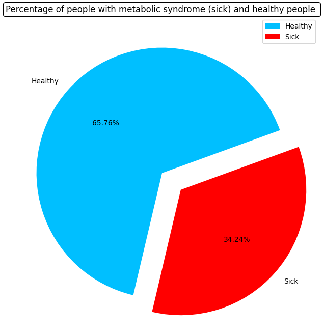
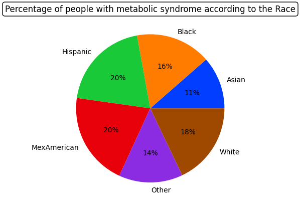
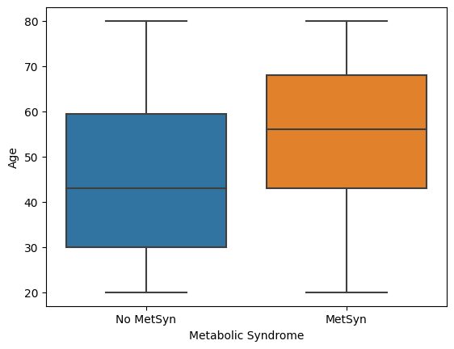
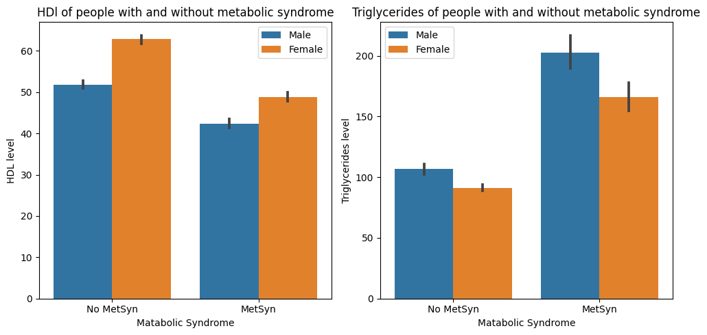

# Metabolic Syndrome Prediction
## Objective:
To predict metabolic syndrome based on common risk factors

### Business problem:
   Metabolic syndrome (MetSyn) is a cluster of risk factors including hypertension, hyperglycemia, and abdominal obesity. Metabolism-related risk factors include diabetes and heart disease. 
 All of these variables raise medical costs. Developing a prediction model that can quickly identify persons at high risk of MetSyn and offer them a treatment plan is crucial. Early prediction of metabolic syndrome will highly impact the quality of life of patients as it gives them a chance for making a change to the bad habit and preventing a serious illness in the future.

### Data:
[ The dataset for analysis came from the NHANES initiative]( https://data.world/informatics-edu/metabolic-syndrome-prediction)

For this dataset, there are 2401 rows and 14 columns.

## Methods
To prepare this data, the data was cleaned, and the following processes were performed:
### Exploratory Data Analysis
    - During the exploratory data analysis, boxplots and histograms were visualized for numeric datatype column. 
    - Also, barplots were visualized for categorical column. 
    - This gave a good baseline for all of the numeric and categorical columns for univariate EDA.

#### Visual 1 
 

> This pie chart shows that the percentage of  .

## Results
 ### Expanatory Data Analysis
    - To visualize the data for explantory purposes, two bargraphs and one regplot were chosen.
    - The bargraphs were chosen to show how the categories compare to each other. 
    - Finally, a regplot was chosen to show the trend of sales when coorelated to the maximum retail price of the product. 

#### Visual 2 

>Who is most affected by metabolic syndrome?
>Hispanic and Mexican Americans are more likely to get metabolic syndrome (20%), followed by white poeple (18%) and Black poeple(16%). The least to get metabolic syndrome are Asian with only 11% of affected people.

#### Visual 3 

>  Reg

#### Visual 4 

>Triglycerides are a type of fat in your blood that your body uses for energy and HDL is hight density lipoproteins cholesterol, sometimes called “good” cholesterol. It absorbs cholesterol in the blood and carries it back to the liver.
>The combination of high levels of triglycerides with low HDL can increase riks for health problems, such as heart attack, and diabetes.
>
>From the graph, we can observe that for healthy people triglycerides is around 80 and 100, with a lower level for womans. This level incresed significantly for poeple who got metabolic syndrome, specially for men, to reach a level over 200.
>
>In case of HDL cholesterol, we observe the opposite phenoma, there is a decrease of HDL level of poeple with metabolic syndrome for both man and women.

## Model
 ### Maching Learning Using the Following Models:
    Three prediction models were tested:
       - LogisticRegression
       - k-nearest neighbors
       - Random Forest

    All the 3 models were tuned to get a better metrics results using grid_search.

 ### Models Evaluated & Results
 
Tuned Random Forest model gave the best results with:
- Accuracy = 0.88
- Precision = 0.85
- Recall = 0.78
- F1-score = 0.86
  
- Number of patients that are healthy but predicted to have MetSyn (false positive): 4,2%.
- Number of patients that are not healthy but predicted to have no MetSyn (false negative): 8,3%.

## Recommendations:
- 
- Choice of variable features: It is better to include parameters that are more related to the diagnosis of the Metabolic Syndrome. In such case, it will be possible to do feature engineering. For example, we could calculate:

  - siMS score = 2*Waist/Height + Gly/5.6 + Tg/1.7 + TAsystolic/130—HDL/1.02 or 1.28 (for male or female subjects, respectively).
  - siMS risk score = siMS score * age/45 or 50 (for male or female subjects, respectively) * family history of cardio/cerebro-vascular events (event = 1.2, no event = 1). 

## Limitations & Next Steps

  

### For further information

For any additional questions, please contact: Asma Ben Hmidene **asmabhpython@gmail.com**
